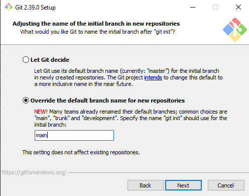
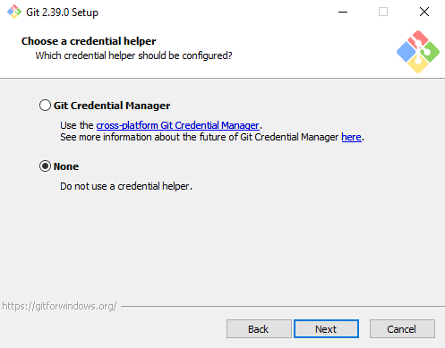
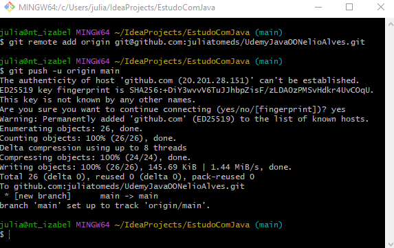
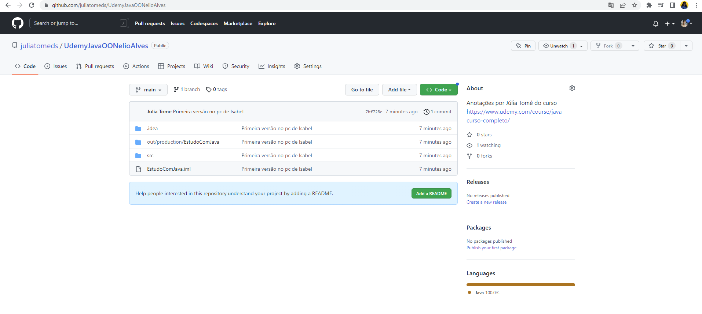

# Seção 12: Bônus - Nivelamento sobre Git e Github

✍Aulas da [Udemy](https://www.udemy.com/course/java-curso-completo/) com Nelio ALves

👩‍💻Arquivo .md escrito por [Júlia Tomé](https://github.com/juliatomeds)

## Git
GIT - é um sistema de versionamento: você controla as modificações de um projeto por meio de
versões chamadas "commits".

Existem vários sistemas que conseguem analisar essas versões, como:
[GitLab](https://gitlab.com/gitlab-org/gitlab),
[Bitbucket](https://bitbucket.org/product) e 
[Github](https://github.com/)

### Repositório remoto e local
Um projeto controlado pelo Git é  chamado de repositório de versionamento.
Tipicamente uma cópia "oficial" do repositório fica salvo em um servidor 
(repositório remoto). 
Cada pessoa que trabalha no  projeto pode fazer uma cópia do 
repositório para seu computador (repositório local). A pessoa
então faz suas alterações no  projeto (novos commits) e depois 
salva as alterações no servidor

Pull ou Clone: pegar a versão do servidor

Commit: salvar versões no seu computador

PUSH: enviar do seu computador pro servidor

## Instalação
Abrir o Prompt de Controle e escrever git, se nada aparecer precisa baixar o GIT através do site
https://git-scm.com/downloads

Colocar Next em tudo, e na seguinte página escrever main


Clicar nesse em None


Abrir o **Git Bash Here**

```bash
git --version
git config --global user.name "Seu nome"
git config --global user.email "Seu email de cadastro do Github"
git config --list
```


**Para usuários do Windows:** 
Ir em opções do Explorador de Arquivos e deixar da seguinte forma:


### Configurar chave SSh no Github
Primeiro é necessário [Gerar um SSH](https://docs.github.com/en/authentication/connecting-to-github-with-ssh/generating-a-new-ssh-key-and-adding-it-to-the-ssh-agent)

Pegar o valor na pasta (.pub) : *C:\Users\julia\.ssh* e colar no https://github.com/settings/ssh/new


### Salvar primeira versão de um projeto no Github
```bash
git init
git add .
git commit -m "Mensagem explicativa"
git branch -M main
```
Agora cria um repositório no Github

E associa ele no Git Bash

```bash
git remote add origin git@github.com:seuusuario/seurepositorio.git
git push -u origin main
```


Dessa forma, é possível visualizar os dados do pc no repositório do [GitHub](https://github.com/juliatomeds/UdemyJavaOONelioAlves) 


### Passo a passo: salvar uma nova versão
```bash
git status
git add .
git commit -m "Mensagem explicativa"
git push
```