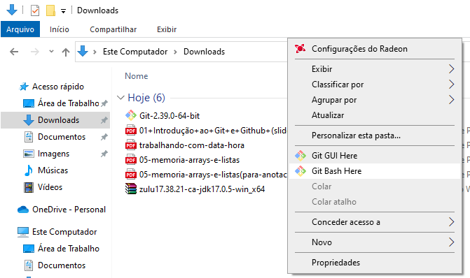
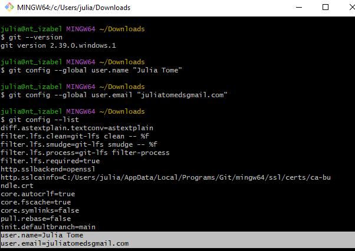
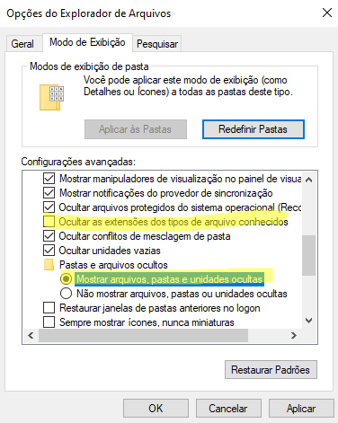
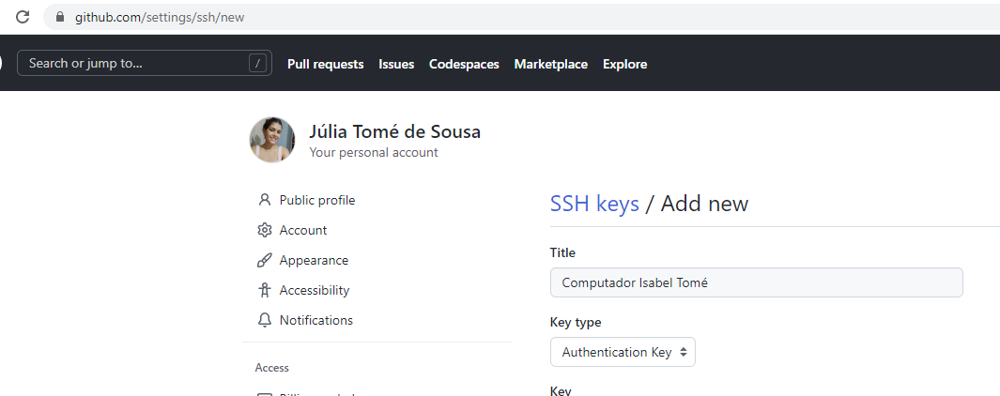
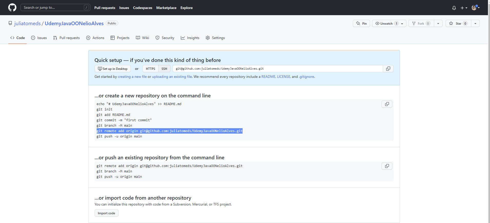

# Seção 12: Bônus - Nivelamento sobre Git e Github

✍Aulas da [Udemy](https://www.udemy.com/course/java-curso-completo/) com Nelio ALves

👩‍💻Arquivo .md escrito por [Júlia Tomé](https://github.com/juliatomeds)

## Git
GIT - é um sistema de versionamento: você controla as modificações de um projeto por meio de
versões chamadas "commits".

Existem vários sistemas que conseguem analisar essas versões, como:
[GitLab](https://gitlab.com/gitlab-org/gitlab),
[Bitbucket](https://bitbucket.org/product) e 
[Github](https://github.com/)

### Repositório remoto e local
Um projeto controlado pelo Git é  chamado de repositório de versionamento.
Tipicamente uma cópia "oficial" do repositório fica salvo em um servidor 
(repositório remoto). 
Cada pessoa que trabalha no  projeto pode fazer uma cópia do 
repositório para seu computador (repositório local). A pessoa
então faz suas alterações no  projeto (novos commits) e depois 
salva as alterações no servidor

Pull ou Clone: pegar a versão do servidor

Commit: salvar versões no seu computador

PUSH: enviar do seu computador pro servidor

## Instalação
Abrir o Prompt de Controle e escrever git, se nada aparecer precisa baixar o GIT através do site
https://git-scm.com/downloads

Colocar Next em tudo, e na seguinte página escrever main


Clicar nesse em None


Abrir o **Git Bash Here**

```bash
git --version
git config --global user.name "Seu nome"
git config --global user.email "Seu email de cadastro do Github"
git config --list
```


**Para usuários do Windows:** 
Ir em opções do Explorador de Arquivos e deixar da seguinte forma:



### Configurar chave SSh no Github
Primeiro é necessário [Gerar um SSH](https://docs.github.com/en/authentication/connecting-to-github-with-ssh/generating-a-new-ssh-key-and-adding-it-to-the-ssh-agent)

Pegar o valor na pasta (.pub) : *C:\Users\julia\.ssh* e colar no https://github.com/settings/ssh/new


### Salvar primeira versão de um projeto no Github
```bash
git init
git add .
git commit -m "Mensagem explicativa"
git branch -M main
```
Agora cria um repositório no Github

E associa ele no Git Bash

```bash
git remote add origin git@github.com:seuusuario/seurepositorio.git
git push -u origin main
```


Dessa forma, é possível visualizar os dados do pc no repositório do [GitHub](https://github.com/juliatomeds/UdemyJavaOONelioAlves) 


### Passo a passo: salvar uma nova versão
```bash
git status
git add .
git commit -m "Mensagem explicativa"
git push
```

### Demo: clonar e modificar um projeto de um repositório remoto que você tem permissão para alterar
O clone traz pro seu pc os dados do repositório

```bash
git clone git@github.com:seuusuario/seurepositorio.git
git add .
git commit -m "Mensagem explicativa"
git push
```

### Verificando o histórico de versões
```bash
git log
git log --oneline
```

### Entendendo Git status
Git status: 

    1) Arquivos modificados

    2)  Arquivos novos 

    3) Arquivos deletados

git add. -> Adiciona os arquivos na área de stage
git add nomedoarquivo.tipo do arquivo -> Só esse arquivo vai ser commitado


### Verificando diferenças
```bash
git diff
```

### Git checkout
Permite modificar temporariamente os arquivos do projeto ao estado de um dado commit
ou branch.

**Código do commit, HEAD**: Cada commit possui um código, que pode ser utilizado para referenciar o commit. 
O último commit do histórico do branch corrente também pode ser referenciado pela palavra HEAD. 
É possível referenciar um commit N versões antes de HEAD usando ~N, por exemplo: 
    • HEAD~1 (penúltimo commit) 
    • HEAD~2 (antepenúltimo commit)

IMPORTANTE: antes de fazer o checkout para voltar para HEAD, certifique-se de que não
haja mudanças nos arquivos. Se você acidentalmente mudou alguma coisa, desfaça as
modificações usando:
```bash
git reset
git clean -df
git checkout -- .
```

### Arquivo .gitignore
É um arquivo que indica o que NÃO deve ser salvo pelo Git. • Geralmente o arquivo .gitignore fica salvo na pasta principal do repositório. Mas
também é possível salvar outros arquivos .gitignore em subpastas do repositório,
para indicar o que deve ser ignorado por cada subpasta.

### Remover arquivos da área de stage
```bash
git status
git reset
```

### Como desfazer modificações não salvas
```bash
git status
git reset
git clean -df
git checkout -- .
```

### Como desfazer o último commit
Desfazer último commit sem desfazer as modificações nos arquivos:
```bash
git status
git reset --soft HEAD~1
```

### Como deletar commits e também modificações nos arquivos
Voltar o projeto ao estado de um dado commit (deletar commits e alterações
posteriores a esse commit)
```bash
git status
git reset --hard <código do commit>
```
Voltar o projeto ao estado do penúltimo commit:
```bash
git status
git reset --hard HEAD~1
```
ATENÇÃO: ação destrutiva!

### Como atualizar o repositório local em relação ao remoto
```bash
git status
git pull <nome do remote> <nome do branch>
```

### Como resolver push rejeitado
Não é permitido enviar um push se seu repositório local está atrasado em
relação ao histórico do repositório remoto! Por exemplo:
```bash
git pull <nome do remote> <nome do branch>
```

### Como sobrescrever um histórico no Github
```bash
git push -f <nome do remote> <nome do branch>
```
ATENÇÃO: ação destrutiva!

### Como apontar o projeto para outro repositório remoto
```bash
git remote set-url origin git@github.com:seuusuario/seurepositorio.git
```